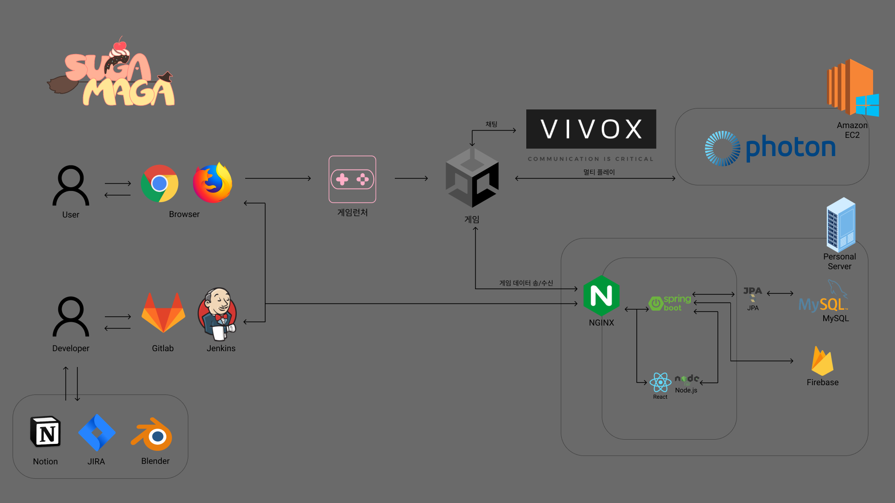

# SugaMaga - 3인칭 멀티 플레이 배틀로얄 게임

## 프로젝트 진행 기간
---
2023.02.20(월) ~ 2023.04.07(금) (총 7주)  

## SugaMaga 배경
---
SugaMaga(이하 슈가마가)는 기존 배틀로얄 장르의 유사점을 극복하고자 기획하게 되었습니다. 기존 배틀로얄 장르 게임의 대부분은  
- 실사 그래픽
- 원거리 전투
- 획일화된 무기군  

등의 공통점을 가지고 있었습니다.  
  
저희 슈가마가는
- 캐쥬얼 그래픽
- 근거리 전투
- 다양한 무기군  

을 차별점으로 가지고있습니다.

## SugaMaga 개요
---
슈가마가는 Sugar(설탕) + Maga(마녀의 라틴어)를 조합하여 만들어진 이름입니다.  
슈가는 맵 곳곳에 배치된 장식들과 무기로 사용되는 과자들을 뜻하며  
마가는 해당 게임의 배틀로얄이 진행되는 원인인 마녀를 뜻합니다.

## 메뉴 구조
---

## 와이어 프레임 (게임)
---

## 와이어 프레임 (웹)
---

## 주요 기술 (Service Architecture)
---

## 협업 툴 및 환경
---
### Git

- 코드 버전 관리
- Convention을 정하여 규칙에 맞게 Commit 메세지 작성

### Jira

- 매주 월요일 이슈 등록하여 Sprint 진행
- Story Point 설정하여 1주 40point 기준으로 진행
- In-Progress -> Done 순으로 진행

### Notion

- 이슈와 진행상황 공유 및 회의록 작성
- Convention 정리
- 공유해야 하는 문서 정리

### 그 외
- MatterMost
- Webex

## 팀원
---
### 전은수
- 팀장
- 플레이어

### 김학철
- 게임서버
- CI/CD

### 박해준
- 맵
- 플레이어 코스튬

### 이석기
- UI
- 인벤토리

### 전상하
- DB
- Web (Front, Back)

### 정진욱
- 스킬 구현
- 몬스터

## 프로젝트 산출물
---
- 메뉴 구조
- Git 전략
- Service Architecture
- Convention
- API 명세서
- ERD
- 회의록
- 1차 발표자료
- 2차 발표자료

## 서비스 화면 (게임)
---

## 서비스 화면 (웹)
---

