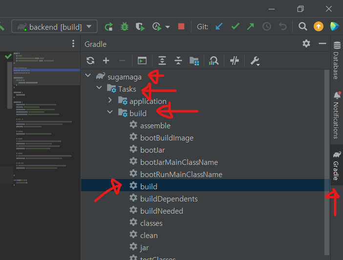

# 포팅 메뉴얼

## [원본 노션 페이지](https://www.notion.so/d06496d026d34082a66ea6f6fabf6150)

## 목차

### 1. [사용 도구](https://www.notion.so/d06496d026d34082a66ea6f6fabf6150)

### 2. [개발 도구](https://www.notion.so/d06496d026d34082a66ea6f6fabf6150)

### 3. [개발 환경](https://www.notion.so/d06496d026d34082a66ea6f6fabf6150)

### 4. [환경변수 형태](https://www.notion.so/d06496d026d34082a66ea6f6fabf6150)

### 5. [CI/CD 구축](https://www.notion.so/d06496d026d34082a66ea6f6fabf6150)

### 6. [빌드 및 실행](https://www.notion.so/d06496d026d34082a66ea6f6fabf6150)

### 7. [외부 서비스 사용](https://www.notion.so/d06496d026d34082a66ea6f6fabf6150)

## 1. 사용 도구

---

- 이슈 관리 : Jira
- 형상 관리 : GitLab
- 커뮤니케이션 : Notion, MatterMost
- 디자인 : Figma
- CI/CD : Jenkins

## 2. 개발 도구

---

- Unity Hub : 3.4.1
- Visual Studio : 2022 (v 17.4.5)
- Visual Studio Code : 1.76.0
- Intellij : 2022.3.2 (Ultimate Edition)

## 3. 개발 환경

---

- 상세 내용
    
    ### Unity
    
    - Unity Editor : 2021.3.9f1
    
    ### Frontend
    
    - Node.js : v16.15.0
    - React : 18.2.0
    
    ### Backend
    
    - Java : openjdk version "11.0.18" 2023-01-17 LTS
    - Spring Boot : 2.7.9
    
    ### Server
    
    - Windows (EC2)
        - CPU : Intel(R) Xeon(R) CPU E5-2686 v4 @ 2.30GHz 2.30 GHz
        - RAM : 16GB
        - OS : Windows Server 2022 Datacenter (21H2) 64bit
    - Ubuntu (Custom)
        - CPU : AMD Ryzen 3200G
        - RAM : 16GB
        - OS : Ubuntu 20.04.5 LTS
    
    ### Service
    
    - Photon Server : 5.0.12.7770
    - MySQL : 8.0.32
    - NginX : 1.18.0
    - Jenkins : 2.395
    

## 4. 환경변수 형태

---

- Frontend
    - .env
        
        ```
        REACT_APP_FB_API_KEY=
        REACT_APP_FB_AUTH_DOMAIN=
        REACT_APP_FB_PROJECT_ID=
        REACT_APP_FB_STORAGE_BUCKET=
        REACT_APP_FB_MESSAGING_SENDER_ID=
        REACT_APP_FB_API_ID=
        REACT_APP_MEASUREMENT_ID=
        
        // firebase 프로젝트 및 웹 앱을 추가하여 발급받은 값을 입력
        // 발급방법은 7. 외부 서비스 사용의 구글 파이어베이스 참고
        ```
        

- Backend
    - application.yml
        
        ```
        server:
          port: 18081
        
          servlet:
            encoding:
              charset: UTF-8
              enabled: true
              force: true
        
        spring:
          profiles:
            active: dev
        
          jpa:
            generate-ddl: 'true'
            database: mysql
            database-platform: org.hibernate.dialect.MySQL8Dialect
            show-sql: 'true'
            properties:
              hibernate:
                format_sql: 'true'
        
          mvc:
            pathmatch:
              matching-strategy: ant_path_matcher
        ```
        
    - application-dev.yml
        
        ```
        spring:
          datasource:
            driver-class-name: com.mysql.cj.jdbc.Driver
            username: [DB USER NAME]
            password: [DB USER PASSWORD]
            url: jdbc:mysql://[HOST]:[PORT]/[USER]?characterEncoding=UTF-8&serverTimezone=UTC&autoReconnect=true
            dbcp:
              testOnBorrow: 'true'
              validationQuery: SELECT 1
        
        key:
          firebase: [FIREBASE APP KEY]
        
        // FIREBASE APP KEY는 REACT_APP_FB_API_KEY와 동일
        // 발급방법은 7. 외부 서비스 사용의 구글 파이어베이스 참고
        ```
        

- 보안 및 소스코드 반출 조건상 DB 접속 정보나 API키가 포함된 파일은 git upload에서 제외되었습니다. 
따라서 젠킨스로 CI / CD 를 구축하였다면 별도로 파일을 업로드해야합니다.
    - 제외된 파일 목록
        - frontend : .env
        - backend : application-dev.yml
    - 제외된 설정파일을 도커 컨테이너(젠킨스)에 업로드하는 방법
        
        ```
        // 전송할 파일이 있는 위치에서 터미널 실행
        
        scp [전송할 파일 이름] [사용자명]@[주소]:~/
        
        // ex .env 파일을 전송하려는 경우
        // scp .env d211@aeoragy.com:~/
        
        // ec2 접속. 유저 home폴더에 전송했으니 접속한 위치에 파일이 존재한다.
        ssh d211@aeoragy.com
        
        // ec2에서 docker jenkins로 복사
        
        docker cp [전송할 파일이름] [젠킨스 컨테이너 이름]:[전송할 위치]
        
        // 전송할 위치를 잘 모를땐 일단 /var/jenkins_home/workspace에서 차례로 목표 폴더로 이동
        // sudo docker cp .env jenkins:/var/jenkins_home/workspace/frontend
        // sudo docker cp [] jenkins:/var/jenkins_home/workspace/SugaMaga_BE/backend/src/main/resources
        
        // 접속
        docker exec -it jenkins /bin/bash
        cd /var/jenkins_home/workspace/frontend/src
        
        // zip 파일이면 unzip. 이외의 확장자는 필요없음
        unzip properties.zip
        
        // 호스트와 연결된 폴더에 파일을 추가할 때에도 같은 방식으로 진행
        ex cp [파일] /var/lib/docker/volumes/[연결된 폴더 이름]/_data
        // ex cp image.png /var/lib/docker/volumes/images/_data
        // ex cp Tayobus.zip /var/lib/docker/volumes/release_file/_data
        ```
        

## 5. CI/CD 구축

---

### Jenkins

- 상세 내용
    
    내용 입력 바랍니다
    
- 호스트의 볼륨과 젠킨스에서 실행하는 프로젝트 볼륨을 연결하는 방법
    1. 연결할 프로젝트의 파이프라인 설정
        
        ```
        stage('Docker Run') {
                    steps {
                        echo 'Pull Docker Image & Docker Image Run'
                        sshagent (credentials: ['UbuntuD211']) {
                            sh "ssh -o StrictHostKeyChecking=no www.aeoragy.com 'docker pull rlagkrcjf9/sugamaga:back'" 
                            sh "ssh -o StrictHostKeyChecking=no www.aeoragy.com 'docker run -d --name be_d211 -p 18081:18081 -v release_file:/release_file rlagkrcjf9/sugamaga:back'"
                        }
                    
                    }
                }
        ```
        
        위 명령어에서 `sh "ssh -o StrictHostKeyChecking=no www.aeoragy.com 'docker run -d --name be_d211 -p 18081:18081 -v release_file:/release_file rlagkrcjf9/sugamaga:back'"`
        
        를 주목한다.
        
        - `-v release_file:/release_file`
            - -v 는 볼륨 마운트를 사용 옵션입니다
            - 앞의 `release_file` 는 host의 볼륨(폴더) 위치입니다.
            - 뒤의 `release_file` 는 컨테이너의 볼륨(폴더) 위치입니다.
            - 호스트의 볼륨 위치는 다음과 같습니다.
                - `/var/lib/docker/volumes/release_file/_data`
                - 예시대로라면 `release_file`에 있는 파일이 연결되는 것이 아니라 그 안의 `_data` 폴더의 파일이 연결되는 것입니다. 프로젝트와 연동할 파일을 추가하려면 `_data` 에 추가 해야합니다.

### Nginx

- [링크](https://www.notion.so/3a6bc5dc5d6c4075be1e484a72707f22)

## 6. 빌드 및 실행

---

- 상세 내용
    
    ### Unity
    
    - Unity Editor 실행
    - File → Build Settings
    - Scene이 여러가지일 경우 Scenes In Build에 Scene파일을 드래그
    - Build 버튼 눌러서 Build 진행
    - Build 진행한 폴더에서 [프로젝트명].exe 실행하여 게임 실행
    - 빌드 파일 구조
        
        ```
        Tayobus.zip
        └Tayobus
        	└SugaMaga.exe
        		.
        		.
        		.
        ```
        
    
    ### Spring Boot
    
    - Intellij → Gradle → [프로젝트 명] → Task → build → build 더블클릭
        
        
        
    - ~\backend\build\libs에서 터미널 실행
    - 터미널에서 `java -jar sugamaga-0.0.1-SNAPSHOT.jar` 입력하여 실행
    
    ### React
    
    - VS Code → 터미널 실행 → npm i 명령어 입력→ npm start 명령어 입력 (vs code에서만 실행)
    - 위의 과정에서 npm i 까지 진행하고
        - npm run build (시간이 꽤 소요된다)
        - npm i -g serve (빌드된 react를 실행하기 위한 패키지)
        - npx serve -l 3000 -s build
            - -l 은 포트를 지정하기 위한 옵션이다
            - -s 은 입력한 디렉터리를 다큐먼트 루트로 하는 옵션이다.
        - Serving! 명령어와 copy할 local address가 나타나면 성공

## 7. 외부 서비스 사용

---

### 구글 파이어베이스 (firebase)

- [링크](https://www.notion.so/0986add0b72e42439ff96204124b9841)

### 포톤 서버 (Photon)

### 비복스 (Vivox)